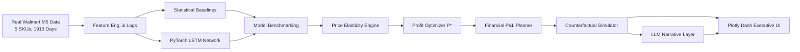

# NAOMI: Neural Analytics for Optimization & Market Intelligence
> **An AI-Powered Business Decision Companion (BDC)**  
> *Extending Leeroy & Leeroy (2025) with Deep Learning Demand Forecasting, Price Elasticity Modeling, and Profit Optimization.*

[](https://www.python.org/)
[](https://pytorch.org/)
[](LICENSE)
[]()

---

## 📌 Executive Summary

NAOMI bridges the gap between black-box AI forecasting and C-suite strategic decision-making. Grounded in the peer-reviewed methodology of **Leeroy & Leeroy (2025)** (*Journal of Risk and Financial Management*), NAOMI transforms demand predictions into actionable pricing, revenue, and margin optimization.

While the original paper evaluated 58 quarterly financial observations of Roblox Corporation, NAOMI scales this paradigm to **high-frequency retail operations using 5.4 years (1,913 daily observations per SKU) of real Walmart M5 competition data**.



---

## 🚀 Current Technical Status

| Phase | Subsystem | Status | Key Output / File |
| :--- | :--- | :--- | :--- |
| **Phase 1** | Project Scaffolding & Schemas | ✅ **Done** | `requirements.txt`, `src/config.py`, `src/data/schemas.py` |
| **Phase 2** | Primary Dataset Curation | ✅ **Done** | `data/raw/walmart_m5_curated.csv` (9,565 rows, 5 curated SKUs) |
| **Phase 3** | Feature Pipeline & Windowing | ✅ **Done** | `src/data/pipeline.py`, `src/data/dataset.py`, `tests/test_data_pipeline.py` (5/5 tests pass) |
| **Phase 4** | Demand Forecasting Engine | ✅ **Done** | `src/models/` (LSTM + 4 Baselines), `tests/test_models.py` (5/5 tests pass), `models_cache/pytorch_lstm.pt` |
| **Phase 5** | Economics, Pricing & Optimization | 🔄 **Ready to start** | Owned by **Member 2** (`src/core/elasticity.py`, `optimizer.py`, `financial.py`) |
| **Phase 6** | Counterfactual Simulator & API | 🔄 **Ready to start** | Owned by **Member 3** (`src/core/simulator.py`, `src/api/main.py`) |
| **Phase 7** | Executive Dashboard | 🔄 **Ready to start** | Owned by **Member 4** (`src/dashboard/`) |
| **Phase 8** | Presentation & LLM Narrative | 🔄 **Ready to start** | Owned by **Member 5** (`presentation/`, `src/llm/`) |

---

## ⚡ Quickstart (Run in 30 Seconds)

### 1. Clone & Install Dependencies
```bash
git clone https://github.com/princexpoddar/NAOMI.git
cd NAOMI
pip install -r requirements.txt
```

### 2. Verify Data Pipeline & SKUs
```bash
python scripts/verify_all_skus.py
```
*Expected Output:* `ALL 5 CURATED SKUS PASS VERIFICATION: ZERO LEAKAGE & CLEAN TENSORS!`

### 3. Run Automated Forecasting Tests
```bash
python tests/test_models.py
```
*Expected Output:* `ALL 5 FORECASTING MODEL TESTS PASSED SUCCESSFULLY!`

### 4. Inspect Model Benchmark Ablation Results
```bash
cat docs/ablation_benchmark_results.csv
```

---

## 🛠️ Instant Developer Jumpstart Guide (By Role)

The foundation (data, features, windowing, and trained models) is completely built. Each teammate can start their designated part immediately without merge conflicts:

---

### 👤 Member 2: Economics, Pricing & Financial Optimization

* **Branch to create**: `git checkout -b feat/pricing-finance`
* **Owned Files**:
  - `src/core/elasticity.py`
  - `src/core/optimizer.py`
  - `src/core/financial.py`
  - `tests/test_elasticity_and_pricing.py`
  - `tests/test_financial_planner.py`
* **How to Start Instantly**:
  You have access to historical sales and prices right now via `DataPipeline`:
  ```python
  from src.data.pipeline import DataPipeline
  pipeline = DataPipeline()
  df = pipeline.load_data()
  df_sku = pipeline.get_sku_dataframe(df, "FOODS_3_090_CA_1")
  # Contains: date, units_sold, sell_price, unit_cost
  ```
* **Tasks to Implement**:
  1. **`src/core/elasticity.py`**:
     - Implement `estimate_elasticity(df_sku: pd.DataFrame) -> float` using OLS regression: $\ln(Q) = \alpha + E_d \ln(P) + \epsilon$.
     - Implement `iso_elastic_demand(p_cand, p_base, q_base, ed) -> float`: $Q(P) = Q_{\text{base}} \left(\frac{P}{P_{\text{base}}}\right)^{E_d}$.
  2. **`src/core/optimizer.py`**:
     - Implement `optimize_price(...) -> dict`: Perform a 100-point grid search + continuous `scipy.optimize.minimize_scalar` bounded in $[0.70 P_0, 1.40 P_0]$ to maximize $\Pi(P) = (P - c) Q(P) - F$.
  3. **`src/core/financial.py`**:
     - Implement `compute_financial_kpis(price, demand, unit_cost, fixed_costs) -> dict` returning Revenue, COGS, Gross Profit, Gross Margin %, and Breakeven volume $\frac{F}{P - c}$.

---

### 👤 Member 3: Counterfactual Simulator & REST API Backend

* **Branch to create**: `git checkout -b feat/simulation-api`
* **Owned Files**:
  - `src/core/simulator.py`
  - `src/api/main.py`
  - `tests/test_simulation.py`
* **How to Start Instantly**:
  Load SKU profiles directly from `src/config.py`:
  ```python
  from src.config import CURATED_SKUS
  # Contains base_price, unit_cost, category, and historical elasticity
  ```
* **Tasks to Implement**:
  1. **`src/core/simulator.py`**:
     - Implement `simulate_scenario(scenario_type: str, base_kpis: dict, params: dict) -> dict` for the 5 scenarios:
       - **Scenario 1 (Price Policy)**: Evaluates user-defined price change ($\Delta P\%$).
       - **Scenario 2 (Macro Demand Shock)**: Demand contraction $Q_{\text{shock}} = Q \times (1 - \text{shock\_pct})$ (e.g. $-15\%$).
       - **Scenario 3 (Supply Chain Cost Inflation)**: Unit cost surge $c_{\text{new}} = c \times (1 + \text{cost\_pct})$ (e.g. $+10\%$).
       - **Scenario 4 (Competitor Price War)**: Competitor drops price by 10% $\implies$ cross-elasticity demand loss ($-20\%$).
       - **Scenario 5 (Leeroy & Leeroy Stagflation)**: $+10\%$ unit cost surge and $-8\%$ demand contraction.
  2. **`src/api/main.py`**:
     - Expose FastAPI routes:
       - `GET /health`
       - `GET /skus`
       - `POST /forecast`
       - `POST /pricing/optimize`
       - `POST /simulate`

---

### 👤 Member 4: Executive Dashboard (Plotly Dash)

* **Branch to create**: `git checkout -b feat/dashboard-ui`
* **Owned Files**:
  - `src/dashboard/app.py`
  - `src/dashboard/layouts/main_layout.py`
  - `src/dashboard/components/cards.py`
  - `src/dashboard/components/charts.py`
  - `src/dashboard/components/controls.py`
  - `src/dashboard/callbacks/main_callbacks.py`
  - `src/dashboard/assets/custom.css`
* **How to Start Instantly**:
  You have the dataset in `data/raw/walmart_m5_curated.csv`, model checkpoints in `models_cache/pytorch_lstm.pt`, and quantitative benchmark results in `docs/ablation_benchmark_results.csv`.
* **Tasks to Implement**:
  1. **`src/dashboard/components/cards.py`**:
     - Build 5 KPI Hero Cards: **Recommended Price ($P^*$)**, **Forecasted Demand ($Q^*$)**, **Projected Revenue ($R^*$)**, **Projected Profit ($\Pi^*$)** with green uplift % badge, and **Gross Margin % / Breakeven Units**.
  2. **`src/dashboard/components/charts.py`**:
     - **Forecast Trajectory Chart**: Actuals vs. LSTM forecast with 90% confidence bands.
     - **Profit & Revenue vs. Price Curve**: Parabolic curve highlighting $P^*$.
     - **Scenario Comparison Chart**: Grouped bar chart comparing Baseline vs. Shocks.
  3. **`src/dashboard/callbacks/main_callbacks.py`**:
     - Connect 4 interactive sliders (Candidate Price Override, Demand Shock %, Cost Surge %, Competitor Price Cut %) to dynamically recalculate KPIs and re-render figures.
  4. Run locally on port `8050`:
     ```bash
     python src/dashboard/app.py
     ```

---

### 👤 Member 5: Presentation, Product Strategy & LLM Narrative

* **Branch to create**: `git checkout -b feat/presentation-llm`
* **Owned Files**:
  - `presentation/SLIDE_DECK_CONTENT.md`
  - `presentation/DEMO_SCRIPT.md`
  - `src/llm/prompts.py`
  - `src/llm/fallback.py`
  - `src/llm/client.py`
* **How to Start Instantly**:
  All background research, problem statement, math formulas, and quantitative ablation results are already compiled in [docs/implementation_plan.md](docs/implementation_plan.md) and [docs/ablation_benchmark_results.csv](docs/ablation_benchmark_results.csv).
* **Tasks to Implement**:
  1. **13-Slide Executive Pitch Deck (`presentation/SLIDE_DECK_CONTENT.md`)**:
     - *Slide 1*: Title & Vision — *NAOMI: AI-Powered Business Decision Companion*.
     - *Slide 2*: Industry Problem — Static spreadsheets vs. volatile demand and black-box AI distrust.
     - *Slide 3*: Research Foundation — Leeroy & Leeroy (2025) Roblox study & Makridakis et al. (2020) M5.
     - *Slide 4*: End-to-End System Architecture — 5-stage modular pipeline.
     - *Slide 5*: Data Engineering — 5 curated Walmart SKUs, 5.4 years (1,913 days), zero leakage.
     - *Slide 6*: Demand Forecasting Results — LSTM beating Naive (MAE 7.99 vs 14.04 on grocery).
     - *Slide 7*: Economics & Profit Optimization — $\Pi(P) = (P - c) Q(P) - F$ concave curves and $P^*$.
     - *Slide 8*: Counterfactual "What-If" Simulation — Stagflation, competitor wars, cost inflation.
     - *Slide 9*: Generative AI Narrative Layer — Executive briefs with compliance disclaimers.
     - *Slide 10*: Live Interactive Dashboard Demonstration — Tour of KPI cards and reactive sliders.
     - *Slide 11*: Business Impact & ROI — Margin defense, revenue boost, risk quantification.
     - *Slide 12*: Roadmap & Future Scope — Multi-product GNN, FastAPI/React upgrade, vector DB.
     - *Slide 13*: Team Contributions & Roles Breakdown.
  2. **`src/llm/fallback.py`**:
     - Build the deterministic rule-based executive brief fallback generator (formats 2-paragraph C-suite summaries with zero hallucination and mandatory disclaimer; 100% offline reliable).
  3. **`presentation/DEMO_SCRIPT.md`**:
     - Write a timed 5-minute presenter walkthrough for evaluation day.

---

## 📂 Repository Layout

```
NAOMI/
├── docs/
│   ├── Business Decision Companion (BDC) – Project Blueprint.pdf
│   ├── implementation_plan.md            # Master technical specification
│   ├── work_log.md                       # Step-by-step progress tracker
│   └── ablation_benchmark_results.csv    # Official model benchmark metrics
├── data/
│   ├── raw/
│   │   └── walmart_m5_curated.csv        # 5 curated real SKUs (1,913 days, 9,565 rows)
│   └── synthetic/
│       └── generate_synthetic_data.py    # Secondary testing harness (Ed = -1.20)
├── models_cache/
│   └── pytorch_lstm.pt                   # Checkpointed PyTorch LSTM weights
├── scripts/
│   ├── build_m5_curated_data.py          # Dataset builder with real calendar events
│   ├── verify_all_skus.py                # Verification script across all 5 SKUs
│   └── train_and_benchmark.py            # Automated training & ablation benchmark runner
├── src/
│   ├── config.py                         # Global constants, hyper-parameters, SKU metadata
│   ├── data/
│   │   ├── schemas.py                    # Pydantic and dataclass models
│   │   ├── pipeline.py                   # Lags, rolling stats, cyclical transforms, scalers
│   │   └── dataset.py                    # PyTorch sliding window dataset & DataLoaders
│   ├── models/
│   │   ├── base.py                       # BaseForecastModel abstract interface
│   │   ├── baseline.py                   # Naive, Seasonal Naive, Moving Average, Ridge
│   │   ├── lstm.py                       # 2-layer stacked PyTorch LSTM with Huber loss
│   │   └── metrics.py                    # MAE, RMSE, MAPE, R2, ablation table generator
│   ├── core/                             # (Member 2 & 3 domain)
│   │   ├── elasticity.py
│   │   ├── optimizer.py
│   │   ├── financial.py
│   │   └── simulator.py
│   ├── dashboard/                        # (Member 4 domain)
│   │   ├── app.py
│   │   ├── layouts/
│   │   ├── components/
│   │   └── callbacks/
│   ├── llm/                              # (Member 5 domain)
│   │   ├── client.py
│   │   ├── prompts.py
│   │   └── fallback.py
│   └── api/
│       └── main.py
├── tests/
│   ├── test_data_pipeline.py             # 5 automated data tests (All passing)
│   └── test_models.py                    # 5 automated model tests (All passing)
├── requirements.txt
├── .gitignore
└── README.md
```

---

## 📖 Key Documentation Links

- 📘 [Business Decision Companion Blueprint (PDF)](docs/Business%20Decision%20Companion%20(BDC)%20%E2%80%93%20Project%20Blueprint.pdf)
- 📐 [Master Implementation Plan](docs/implementation_plan.md)
- 📝 [Step-by-Step Work Log & Progress Tracker](docs/work_log.md)
- 📊 [Model Ablation Benchmark Results](docs/ablation_benchmark_results.csv)
