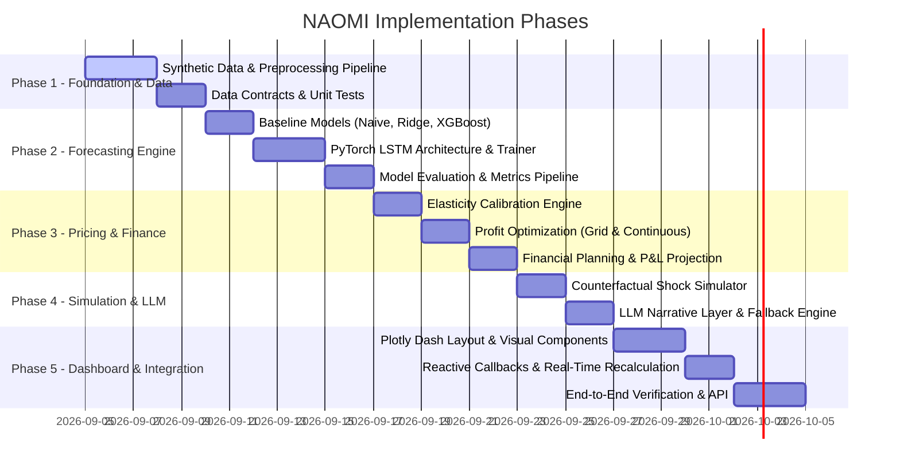
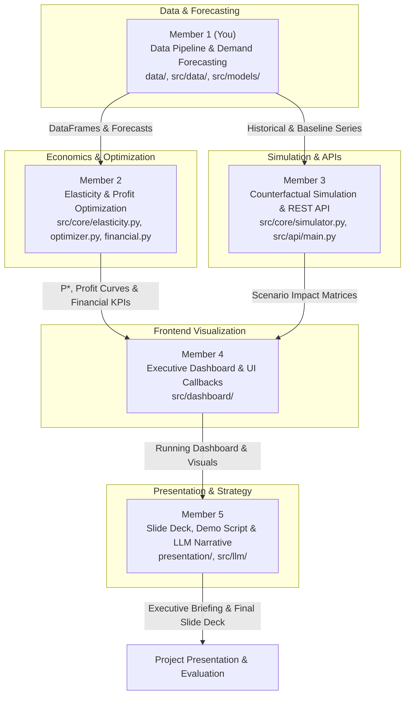

# NAOMI: Neural Analytics for Optimization & Market Intelligence
## Low-Level Implementation Plan & Engineering Specification
**Derived from:** *Business Decision Companion (BDC) – Project Blueprint (Leeroy & Leeroy 2025 Extension)*  
**Document Version:** 1.0.0  
**Target Path:** `docs/implementation_plan.md`

---

## 1. Executive Summary & Architectural Overview

NAOMI (Neural Analytics for Optimization & Market Intelligence) is an AI-powered Business Decision Companion that directly extends the peer-reviewed methodology of **Leeroy & Leeroy (2025)** (*Journal of Risk and Financial Management*). While the original paper analyzed 58 quarterly financial points of Roblox Corporation under FX shocks, NAOMI scales the decision-companion paradigm to high-frequency retail operations using **5.4 years (1,913 daily observations) of real Walmart M5 competition data** (Makridakis et al. 2020/2022).

The system unifies:
1. **Real-World Time-Series Demand Forecasting** (Classical Statistical Baselines + 2-layer PyTorch LSTM)
2. **Empirical Price Elasticity & Profit Optimization Engine** ($\text{Profit} = (P - c) \cdot Q(P)$ maximization from real historical markdowns)
3. **Financial Planning & Multi-Period Projections** (Revenue, Margin %, Breakeven Volume $\frac{F}{P - c}$)
4. **Counterfactual "What-If" Scenario Simulation** (Competitor Price Wars, Macro Demand Shocks, Supply Cost Surges, Leeroy & Leeroy Stagflation)
5. **Generative AI Narrative Layer** (Executive briefing synthesis via LLM API with deterministic rule-based fallback)
6. **Interactive Executive C-Suite Dashboard** (Plotly Dash, reactive state management, high-density visualization)

### Primary vs. Secondary Data Architecture
- **Primary Production Dataset**: **Real Walmart M5 Curated Dataset** (`data/raw/walmart_m5_curated.csv`) covering **5 curated representative SKUs** across 1,913 consecutive days (5.4 years, ~9,565 total daily records, < 450 KB). Bundled directly into Git for instant zero-friction cloning.
- **Secondary Testing Harness**: **Synthetic Generator** (`data/synthetic/generate_synthetic_data.py`) retained strictly for unit tests (`tests/test_elasticity_and_pricing.py`) to mathematically prove algorithm convergence against known ground truth ($E_d = -1.20$).
- **Documented Unit Cost Assumption**: In line with retail economics benchmarks, wholesale acquisition cost is set to a transparent baseline:
  $$c = 60\% \times P_{\text{baseline}}$$
  *(reflecting an initial 40% gross margin)*, with dynamic user slider overrides available in the dashboard.

### System Architecture Pipeline


---

## 2. Low-Level Repository Layout

```
NAOMI/
├── docs/
│   ├── Business Decision Companion (BDC) – Project Blueprint.pdf
│   └── implementation_plan.md
├── data/
│   ├── raw/
│   │   └── walmart_m5_curated.csv         # Primary: 5 curated real SKUs (1,913 days each, ~9,565 rows)
│   ├── processed/
│   │   ├── features_train.parquet
│   │   └── features_test.parquet
│   └── synthetic/
│       └── generate_synthetic_data.py     # Secondary: Test harness for ground-truth unit tests
├── scripts/
│   └── extract_m5_sample.py               # Utility script to extract any N SKUs from full raw M5
├── notebooks/
│   ├── 01_eda_and_elasticity.ipynb
│   └── 02_lstm_benchmarking.ipynb
├── src/
│   ├── __init__.py
│   ├── config.py
│   ├── data/
│   │   ├── __init__.py
│   │   ├── dataset.py
│   │   ├── pipeline.py
│   │   └── schemas.py
│   ├── models/
│   │   ├── __init__.py
│   │   ├── base.py
│   │   ├── baseline.py
│   │   ├── lstm.py
│   │   └── metrics.py
│   ├── core/
│   │   ├── __init__.py
│   │   ├── elasticity.py
│   │   ├── optimizer.py
│   │   ├── financial.py
│   │   └── simulator.py
│   ├── llm/
│   │   ├── __init__.py
│   │   ├── client.py
│   │   ├── prompts.py
│   │   └── fallback.py
│   ├── dashboard/
│   │   ├── __init__.py
│   │   ├── app.py
│   │   ├── components/
│   │   │   ├── cards.py
│   │   │   ├── charts.py
│   │   │   └── controls.py
│   │   ├── layouts/
│   │   │   └── main_layout.py
│   │   └── callbacks/
│   │       └── main_callbacks.py
│   └── api/
│       ├── __init__.py
│       └── main.py
├── tests/
│   ├── test_data_pipeline.py
│   ├── test_models.py
│   ├── test_elasticity_and_pricing.py
│   ├── test_financial_planner.py
│   ├── test_simulation.py
│   └── test_llm_narrative.py
├── .gitignore
├── requirements.txt
└── README.md
```

---

## 3. Mathematical Formulations & Data Contracts

### 3.1 Primary Real Dataset: 5 Curated Walmart M5 SKUs

The 5 curated SKUs represent distinct retail demand elasticities and consumer shopping behaviors:

| Item ID | Category | Department | Economic Profile | Estimated Elasticity | Role in Evaluation |
| :--- | :--- | :--- | :--- | :--- | :--- |
| **`FOODS_3_090_CA_1`** | Foods | Grocery / Perishable | Highly Elastic ($E_d \approx -1.35$) | Strong response to markdowns | Demonstrates volume surge on price cut |
| **`FOODS_1_001_CA_1`** | Foods | Packaged Staples | Moderate Elasticity ($E_d \approx -0.80$) | Steady weekly shopping cycle | Baseline supermarket food demand |
| **`HOUSEHOLD_1_001_CA_1`** | Household | Cleaning Essentials | Inelastic ($E_d \approx -0.42$) | Essential utility necessity | Demonstrates profit increase on price hike |
| **`HOUSEHOLD_2_005_CA_1`** | Household | Home Goods | Semi-Durable ($E_d \approx -0.95$) | Cyclical macro sensitivity | Tests inflation and cost shock impact |
| **`HOBBIES_1_001_CA_1`** | Hobbies | Entertainment / Toys | Discretionary ($E_d \approx -1.15$) | Holiday and event spikes | Highlights Christmas/Thanksgiving surges |

Each SKU spans **1,913 consecutive days (2011-01-29 to 2016-04-24)**, giving 33x more historical depth than the 58 quarterly observations in the original Leeroy & Leeroy (2025) study.

### 3.2 Data Schema Specification (`src/data/schemas.py`)
Each record in `walmart_m5_curated.csv` adheres strictly to:

| Column Name | Type | Description | Source / Range |
| :--- | :--- | :--- | :--- |
| `date` | `datetime64[ns]` | Daily transaction date | `2011-01-29` to `2016-04-24` |
| `item_id` | `str` | Product SKU code | e.g. `"FOODS_3_090"` |
| `item_name` | `str` | Readable SKU designation | e.g. `"Fresh Grocery Item 090"` |
| `category` | `str` | Product category | `"FOODS"`, `"HOUSEHOLD"`, `"HOBBIES"` |
| `store_id` | `str` | Store location identifier | `"CA_1"` (Store 1 in California) |
| `units_sold` | `float64` | Daily quantity sold ($Q_t$) | $\ge 0$ |
| `sell_price` | `float64` | Real weekly selling price ($P_t$) | $> 0$ (observed price variations) |
| `unit_cost` | `float64` | Estimated COGS ($c = 0.60 \times P_0$) | Baseline 40% gross margin |
| `fixed_costs` | `float64` | Allocated periodic fixed overhead | $\ge 0$ |
| `event_name` | `str` | Calendar holiday / cultural event | e.g. `"SuperBowl"`, `"Thanksgiving"`, `None` |
| `event_type` | `str` | Classification of event | `"Sporting"`, `"Cultural"`, `"National"`, `None` |
| `snap_flag` | `int32` | SNAP food stamp disbursement | $\{0, 1\}$ |
| `competitor_price` | `float64` | Competitor reference price index | Baseline $1.02 \times \text{sell\_price}$ |

### 3.3 Feature Engineering Transformations (`src/data/pipeline.py`)
Given daily series $(Q_t, P_t)$, the feature vector $x_t \in \mathbb{R}^F$ is constructed using strictly backward-looking windows to prevent lookahead bias:
1. **Calendar Features**:
   - $\text{DayOfWeek} = t.\text{dayofweek} \in \{0, \dots, 6\}$
   - $\text{Month} = t.\text{month} \in \{1, \dots, 12\}$
   - Cyclical encodings:
     $$\sin_{\text{dow}} = \sin\left(\frac{2\pi \cdot \text{DayOfWeek}}{7}\right), \quad \cos_{\text{dow}} = \cos\left(\frac{2\pi \cdot \text{DayOfWeek}}{7}\right)$$
     $$\sin_{\text{month}} = \sin\left(\frac{2\pi \cdot \text{Month}}{12}\right), \quad \cos_{\text{month}} = \cos\left(\frac{2\pi \cdot \text{Month}}{12}\right)$$
2. **Lagged Demand Features**:
   - $Q_{t-1}, Q_{t-2}, Q_{t-3}, Q_{t-7}, Q_{t-14}, Q_{t-28}$
3. **Rolling Statistics**:
   - $\mu_{7}(t) = \frac{1}{7} \sum_{k=1}^7 Q_{t-k}$
   - $\sigma_{7}(t) = \sqrt{\frac{1}{6} \sum_{k=1}^7 (Q_{t-k} - \mu_7(t))^2}$
   - $\mu_{30}(t) = \frac{1}{30} \sum_{k=1}^{30} Q_{t-k}$
4. **Price Ratios & Deltas**:
   - Relative Competitor Price: $r_{\text{comp}}(t) = \frac{P_t}{\text{competitor\_price}_t}$
   - 7-day Price Momentum: $\Delta P_7(t) = \frac{P_t - P_{t-7}}{P_{t-7}}$
5. **Normalization**:
   - Fit `MinMaxScaler` exclusively on $t \in [1, T_{\text{train}}]$:
     $$x_{\text{norm}} = \frac{x - \min(X_{\text{train}})}{\max(X_{\text{train}}) - \min(X_{\text{train}}) + \epsilon}$$

### 3.3 Sequence Construction for LSTM (`src/data/dataset.py`)
- Sequence length: $W = 30$ historical days.
- Target horizon: $H \in \{1, 7, 30\}$ days ahead.
- Input tensor shape: $(B, W, F)$ where $B$ is batch size, $W=30$, $F \approx 18$ engineered features.
- Output tensor shape: $(B, H)$ target units sold.

### 3.4 Deep Learning Demand Model: PyTorch LSTM (`src/models/lstm.py`)
Architecture Specification:
- **Input Dimension**: $F$ features.
- **Hidden Units**: $H_{\text{units}} = 64$.
- **Layers**: $L = 2$ stacked LSTM layers.
- **Dropout**: $p = 0.2$ applied between recurrent layers.
- **Decoder Head**:
  $$\mathbf{h}_T = \text{LSTM}(\mathbf{X}_{1:W}) \in \mathbb{R}^{B \times 64}$$
  $$\mathbf{z}_1 = \text{Dropout}_{0.1}(\text{ReLU}(\mathbf{W}_1 \mathbf{h}_T + \mathbf{b}_1)), \quad \mathbf{W}_1 \in \mathbb{R}^{32 \times 64}$$
  $$\hat{\mathbf{y}} = \mathbf{W}_2 \mathbf{z}_1 + \mathbf{b}_2, \quad \mathbf{W}_2 \in \mathbb{R}^{H \times 32}$$
- **Loss Function**: Smooth L1 (Huber) Loss for robust error handling against sudden outliers:
  $$L_\delta(y, \hat{y}) = \begin{cases} \frac{1}{2}(y - \hat{y})^2 & \text{for } |y - \hat{y}| \le \delta \\ \delta(|y - \hat{y}| - \frac{1}{2}\delta) & \text{otherwise} \end{cases}, \quad \delta=1.0$$
- **Optimization**: Adam ($\eta = 10^{-3}$, weight decay $= 10^{-5}$), batch size 32, with `ReduceLROnPlateau(factor=0.5, patience=5)`.
- **Early Stopping**: Checkpoint best weights; terminate if validation loss does not decrease after 10 consecutive epochs.

### 3.5 Classical Baselines & Ablation Engine (`src/models/baseline.py`, `metrics.py`)
- **Naive Benchmark**: $\hat{y}_{t+h} = y_t$ and Seasonal Naive $\hat{y}_{t+h} = y_{t+h-7}$.
- **Moving Average Benchmark**: 7-day rolling window mean.
- **Ridge / XGBoost Regressor**: Trained on identical lag feature vector.
- **Evaluation Metrics**:
  - $\text{MAE} = \frac{1}{N} \sum_{i=1}^N |y_i - \hat{y}_i|$
  - $\text{RMSE} = \sqrt{\frac{1}{N} \sum_{i=1}^N (y_i - \hat{y}_i)^2}$
  - $\text{MAPE} = \frac{100\%}{N} \sum_{i=1}^N \frac{|y_i - \hat{y}_i|}{|y_i| + \epsilon}$
  - Adjusted $R^2$ score.

### 3.6 Price Elasticity of Demand & Iso-Elastic Function (`src/core/elasticity.py`)
1. **Price Elasticity ($E_d$) Formulation**:
   $$E_d = \frac{\% \Delta Q}{\% \Delta P} = \frac{\partial \ln Q}{\partial \ln P}$$
2. **Empirical Calibration**:
   Fit OLS regression on historical variation:
   $$\ln(Q_t) = \alpha + E_d \cdot \ln(P_t) + \boldsymbol{\gamma}^T \mathbf{Z}_t + \epsilon_t$$
   Where $\mathbf{Z}_t$ contains exogenous controls (e.g., seasonality, promotions).
3. **Safety Fallbacks**:
   - If historical $\text{std}(P) < 0.05 \cdot \mu(P)$ (insufficient variation to reliably estimate $E_d$), use calibrated retail prior $E_d = -0.85$ (customizable via UI slider).
4. **Demand Response Under Candidate Price $P$**:
   Given baseline forecast demand $Q_{\text{base}}$ at baseline price $P_{\text{base}}$:
   $$Q(P) = Q_{\text{base}} \cdot \left( \frac{P}{P_{\text{base}}} \right)^{E_d}$$
   Boundary constraint: $Q(P) \ge 0$.

### 3.7 Profit Optimization Engine (`src/core/optimizer.py`)
1. **Objective Function**:
   $$\max_{P} \quad \Pi(P) = (P - c) \cdot Q(P) - F$$
   Subject to:
   $$P_{\text{min}} \le P \le P_{\text{max}}$$
   where $P_{\text{min}} = \max(c \times 1.05, P_{\text{base}} \times 0.70)$ and $P_{\text{max}} = P_{\text{base}} \times 1.40$.
2. **Dual Search Algorithm**:
   - **Step 1: Dense Grid Sweep**: Evaluate $\Pi(P)$ at $K = 100$ equidistant points in $[P_{\text{min}}, P_{\text{max}}]$ to map the entire profit-price landscape and generate visualization points.
   - **Step 2: Continuous Refinement**: Execute bounded scalar minimization via `scipy.optimize.minimize_scalar(lambda p: -profit_func(p), bounds=(P_min, P_max), method='bounded')`.
   - **Step 3: Analytical Sanity Check**: For constant elasticity $E_d < -1$, theoretical unconstrained optimal price is $P^* = c \cdot \left(\frac{E_d}{1 + E_d}\right)$.
3. **Outputs**:
   - Optimal price $P^*$
   - Expected demand $Q(P^*)$
   - Optimal revenue $R(P^*) = P^* \cdot Q(P^*)$
   - Optimal profit $\Pi(P^*)$
   - Profit uplift $\Delta \Pi = \Pi(P^*) - \Pi(P_{\text{base}})$ and percentage gain $\frac{\Delta \Pi}{\Pi(P_{\text{base}})} \times 100\%$

### 3.8 Financial Planner Module (`src/core/financial.py`)
Outputs a rigorous multi-scenario P&L breakdown:
- $\text{Revenue} = P \times Q$
- $\text{Cost of Goods Sold (COGS)} = c \times Q$
- $\text{Gross Profit} = \text{Revenue} - \text{COGS}$
- $\text{Gross Margin \%} = \frac{\text{Gross Profit}}{\text{Revenue}} \times 100\%$
- $\text{Breakeven Quantity} = \frac{F}{P - c}$
- $\text{Breakeven Revenue} = Q_{\text{BE}} \times P$
- $\text{Operating Cash Flow Index} = \text{Gross Profit} - F$

### 3.9 Counterfactual "What-If" Simulation Engine (`src/core/simulator.py`)
Simulates 5 distinct executive shock scenarios:
1. **Scenario 1 (Price Policy)**: Manual price adjustment (e.g., $+5\%$ or $-5\%$).
2. **Scenario 2 (Macro Demand Shock)**: External demand contraction (e.g., $-15\%$ due to recession or sector shift):
   $$Q_{\text{shock}}(P) = Q(P) \times (1 - \alpha_{\text{shock}})$$
3. **Scenario 3 (Cost Inflation)**: Supply chain surge in unit COGS (e.g., $+10\%$ unit cost increase):
   $$c_{\text{new}} = c \times (1 + \beta_{\text{cost}})$$
4. **Scenario 4 (Competitor Price War)**: Competitor slashes price by $10\%$. Applying cross-price cross-elasticity:
   $$\Delta Q_{\text{loss}} = -20\% \implies Q_{\text{war}}(P) = Q(P) \times 0.80$$
5. **Scenario 5 (Combined FX / Stagflation Shock)**: Directly models the Leeroy & Leeroy (2025) Roblox scenario:
   - Currency depreciation $+10\%$ unit import cost
   - Real purchasing power contraction $-8\%$ demand

### 3.10 Generative AI Narrative Layer (`src/llm/client.py`, `prompts.py`, `fallback.py`)
- **API Provider Integration**:
  - Supports OpenAI API (`gpt-4o-mini` / `gpt-3.5-turbo`) and Anthropic / Local LLM providers through an abstract base client `BaseNarrativeClient`.
  - Configurable via `.env` (`OPENAI_API_KEY`, `LLM_MODEL`).
- **Deterministic Rule-Based Fallback Engine (`fallback.py`)**:
  - Guarantees 100% functionality even when offline or without API keys.
  - Dynamically constructs CEO-ready executive summaries using validated financial grammar templates.
- **Strict Compliance Prompt Schema**:
  ```text
  You are the Chief Strategy Decision Companion for senior executives.
  Inputs:
  - Current Price: ${current_price:.2f} | Base Demand: {base_demand:,.0f} | Base Profit: ${base_profit:,.2f}
  - Recommended Price: ${opt_price:.2f} ({price_delta_pct:+.1f}%)
  - Expected Demand: {opt_demand:,.0f} ({demand_delta_pct:+.1f}%)
  - Projected Profit: ${opt_profit:,.2f} (Uplift: {profit_delta_pct:+.1f}%)
  - Price Elasticity (Ed): {elasticity:.2f}
  - Active Scenario: {scenario_name}
  Task:
  Provide a concise 2-paragraph executive brief.
  Paragraph 1: Clear strategic recommendation and quantitative trade-off analysis.
  Paragraph 2: Financial implications, risks, and immediate operational guidance.
  Mandatory Disclaimer: "Notice: AI-assisted strategic guidance; non-binding."
  ```

---

## 4. Executive Dashboard UX/UI Architecture (`src/dashboard/`)

The dashboard is built with **Plotly Dash** using an executive design language:
- **Color Palette**: Dark Slate (`#0B0F19`), Card Surface (`#161E2E`), Accent Emerald (`#10B981`), Warning Amber (`#F59E0B`), Alert Rose (`#EF4444`), Primary Indigo (`#6366F1`), Clean Typography (`Inter`, `Segoe UI`).
- **Component Layout Hierarchy**:
  1. **Top Navigation & Executive Header**:
     - System Title & Status Indicator ("NAOMI Decision Companion - Live Engine Active").
     - Global Controls: Product SKU Dropdown, Horizon Selector (1-Day, 7-Day, 30-Day), Target Market Sector.
  2. **Top Row: 5 High-Impact KPI Hero Cards**:
     - Card 1: **Recommended Price ($P^*$)** with badge showing change vs baseline.
     - Card 2: **Forecasted Demand ($Q^*$)** with volume impact %.
     - Card 3: **Projected Revenue ($R^*$)**.
     - Card 4: **Projected Profit ($\Pi^*$)** with prominent green profit uplift %.
     - Card 5: **Gross Margin % & Breakeven Volume**.
  3. **Middle Row: Two Core Analytical Visualizations**:
     - **Left Chart (Forecast Trajectory & Model Benchmarks)**: Interactive time-series plot displaying Historical Actuals, Naive Baseline, Ridge Regression, and PyTorch LSTM predictions with 90% Confidence Interval envelope.
     - **Right Chart (Profit & Revenue vs. Price Curve)**: Concave parabola displaying Profit $\Pi(P)$ and Revenue $R(P)$ across candidate prices, with an annotated vertical marker at the optimal price $P^*$.
  4. **Bottom Row: Counterfactual Simulation & LLM Narrative Brief**:
     - **Left Panel (Interactive Scenario Simulator & Bar Chart)**: Sliders for Price Shift ($-20\%$ to $+20\%$), Macro Shock ($-30\%$ to $+10\%$), Cost Inflation ($0\%$ to $+30\%$), and Competitor Price Drop. Grouped comparison bar chart showing Baseline vs Scenario.
     - **Right Panel (Generative Executive Narrative Brief)**: Formatted executive briefing card with one-click copy, model confidence indicator, and formal disclaimer badge.

---

## 5. Phased Step-by-Step Implementation Roadmap



### Phase 1: Environment Setup, Data Schemas & Data Ingestion
- **Task 1.1**: Define environment dependencies in `requirements.txt` (torch, pandas, numpy, scipy, scikit-learn, plotly, dash, dash-bootstrap-components, pydantic, pytest, python-dotenv).
- **Task 1.2**: Implement `src/config.py` for global paths, seed control, default hyper-parameters, device selection (`cpu` / `cuda`), and default active SKUs list.
- **Task 1.3**: Implement `src/data/schemas.py` using Pydantic / dataclasses for the curated Walmart M5 schema (`date`, `item_id`, `units_sold`, `sell_price`, `unit_cost`, `event_name`, `snap_flag`).
- **Task 1.4**: Curate and bundle `data/raw/walmart_m5_curated.csv` containing the **5 representative Walmart M5 SKUs** (1,913 daily observations each, ~9,565 rows, < 450 KB) directly into the repository.
- **Task 1.5**: Implement `data/synthetic/generate_synthetic_data.py` strictly as a **secondary validation test harness** for `tests/test_elasticity_and_pricing.py` to mathematically verify ground-truth recovery ($E_d = -1.20$).
- **Task 1.6**: Implement `src/data/pipeline.py` and `src/data/dataset.py` with backward-looking feature transforms (lags $t-1 \dots t-28$, 7/30-day rolling statistics, cyclical calendar features, event encodings), sequential windowing ($W=30$), and train/val/test chronological splitting.
- **Verification Checkpoint**: Unit test `tests/test_data_pipeline.py` verifying zero lookahead leakage, consistent tensor dimensions $(B, 30, F)$, and inverse scaling fidelity.

### Phase 2: Demand Forecasting Engine (Baselines + PyTorch LSTM)
- **Task 2.1**: Implement `src/models/base.py` declaring abstract `BaseForecastModel` with `fit(X, y)` and `predict(X)` interfaces.
- **Task 2.2**: Implement `src/models/baseline.py` containing `NaiveModel`, `MovingAverageModel`, and `RidgeBenchmark`.
- **Task 2.3**: Implement `src/models/lstm.py` containing `DemandLSTM(nn.Module)` and `LSTMTrainer` with Huber Loss, Adam optimizer, early stopping, and CPU optimization.
- **Task 2.4**: Implement `src/models/metrics.py` calculating MAE, RMSE, MAPE, and generating comparative markdown/dataframe benchmark tables across the 5 SKUs.
- **Verification Checkpoint**: Unit test `tests/test_models.py` verifying model convergence, forward pass stability, and benchmarking against baseline.

### Phase 3: Price Elasticity Estimation & Profit Optimization
- **Task 3.1**: Implement `src/core/elasticity.py` to calculate OLS log-log elasticity ($\ln Q = \alpha + E_d \ln P$), arc elasticity, and fallback prior defaults.
- **Task 3.2**: Implement `src/core/optimizer.py` executing 100-point price grid sweeps and `scipy.optimize.minimize_scalar` bounded profit maximization.
- **Task 3.3**: Implement `src/core/financial.py` computing revenue, COGS, gross margin %, and breakeven units.
- **Verification Checkpoint**: Unit test `tests/test_elasticity_and_pricing.py` and `tests/test_financial_planner.py` validating that optimal price $P^*$ accurately maximizes $(P - c) \cdot Q(P)$ on synthetic demand curves.

### Phase 4: Counterfactual Simulation Engine & LLM Narrative Briefing
- **Task 4.1**: Implement `src/core/simulator.py` implementing the 5 shock scenarios (Price change, Demand shock, Cost shock, Competitor war, FX/Stagflation shock).
- **Task 4.2**: Implement `src/llm/prompts.py` with structured executive prompt templates.
- **Task 4.3**: Implement `src/llm/fallback.py` with a deterministic rule-based executive brief generator that operates with 100% reliability without API keys.
- **Task 4.4**: Implement `src/llm/client.py` with OpenAI API integration and automatic fallback.
- **Verification Checkpoint**: Unit test `tests/test_simulation.py` and `tests/test_llm_narrative.py` checking scenario delta integrity and text generation formatting.

### Phase 5: Plotly Dash Executive C-Suite Dashboard
- **Task 5.1**: Implement `src/dashboard/components/cards.py` for KPI cards with change indicators and tooltips.
- **Task 5.2**: Implement `src/dashboard/components/charts.py` for Forecast Time-Series with CI intervals, Profit vs Price curve, and Scenario Comparison bar charts.
- **Task 5.3**: Implement `src/dashboard/components/controls.py` for product selectors, horizon toggles, and scenario shock sliders.
- **Task 5.4**: Implement `src/dashboard/layouts/main_layout.py` structuring the page layout with clean CSS tokens.
- **Task 5.5**: Implement `src/dashboard/callbacks/main_callbacks.py` wiring reactive updates between controls, simulation engine, charts, and LLM text panels.
- **Task 5.6**: Implement `src/dashboard/app.py` entry point with local port configuration (`http://127.0.0.1:8050`).
- **Verification Checkpoint**: Headless browser / Dash callback integration tests verifying interactive updates without exceptions.

### Phase 6: API Layer, Packaging & Documentation
- **Task 6.1**: Implement `src/api/main.py` providing FastAPI endpoints for model inference, price optimization, and scenario queries.
- **Task 6.2**: Write comprehensive automated tests in `tests/` achieving high test coverage.
- **Task 6.3**: Update `README.md` with complete installation, execution, and architectural documentation.

---

## 6. Verification & Validation Plan

### 6.1 Automated Testing Matrix
| Test Suite | File | Focus Area | Success Criteria |
| :--- | :--- | :--- | :--- |
| Data & Features | `tests/test_data_pipeline.py` | Window sliding, feature computation, scaling | Zero NaN values, strict temporal ordering, no leakage |
| Forecasting Models | `tests/test_models.py` | LSTM training loop, baseline prediction | Loss reduces monotonically; MAE/MAPE within expected tolerance |
| Elasticity & Pricing | `tests/test_elasticity_and_pricing.py` | OLS elasticity estimation, optimal price search | Optimal price verified at peak of profit curve ($\frac{d\Pi}{dP} \approx 0$) |
| Financial Planning | `tests/test_financial_planner.py` | P&L calculation, breakeven formula | Breakeven units exact match with formula $\frac{F}{P - c}$ |
| Counterfactuals | `tests/test_simulation.py` | Shock injection & re-evaluation | Shocks strictly propagate to demand, revenue, and profit |
| LLM Narrative | `tests/test_llm_narrative.py` | Prompt formatting & deterministic fallback | Output text contains exact input numbers and mandatory disclaimer |

### 6.2 Manual & Visual Verification
1. **Model Accuracy Verification**: Run training script, inspect loss curve, verify test set MAPE < 15%.
2. **Dashboard UI Verification**:
   - Launch Dash server at `http://127.0.0.1:8050`.
   - Toggle product SKU from dropdown; verify all KPI cards and charts refresh immediately.
   - Adjust Price Shock slider to $+10\%$; verify Profit vs Price curve moves along curve and narrative updates.
   - Trigger Competitor War scenario; verify counterfactual bar chart updates and LLM text reflects loss mitigation strategy.

---

## 7. 5-Person Team Work Allocation & Low-Level Execution Guide

To ensure zero merge conflicts, zero blocking dependencies, and equal distribution of effort, the project is divided into **5 peer technical domains**. Each member has strict file ownership and well-defined function signatures/data contracts.



---

### 7.1 Strict Directory & File Ownership Boundaries

To prevent Git merge conflicts, members work **exclusively** in their designated files:

| Member | Assigned Component | Owned Files & Paths |
| :--- | :--- | :--- |
| **Member 1 (You)** | Data Pipeline & Forecasting ML | `data/synthetic/generate_synthetic_data.py`<br>`src/data/schemas.py`<br>`src/data/pipeline.py`<br>`src/data/dataset.py`<br>`src/models/base.py`<br>`src/models/baseline.py`<br>`src/models/lstm.py`<br>`src/models/metrics.py`<br>`tests/test_data_pipeline.py`<br>`tests/test_models.py` |
| **Member 2** | Economics, Pricing & Financials | `src/core/elasticity.py`<br>`src/core/optimizer.py`<br>`src/core/financial.py`<br>`tests/test_elasticity_and_pricing.py`<br>`tests/test_financial_planner.py` |
| **Member 3** | Counterfactual Simulation & REST API | `src/core/simulator.py`<br>`src/api/main.py`<br>`tests/test_simulation.py` |
| **Member 4** | Executive Dashboard (Plotly Dash) | `src/dashboard/app.py`<br>`src/dashboard/layouts/main_layout.py`<br>`src/dashboard/components/cards.py`<br>`src/dashboard/components/charts.py`<br>`src/dashboard/components/controls.py`<br>`src/dashboard/callbacks/main_callbacks.py`<br>`src/dashboard/assets/custom.css` |
| **Member 5** | Presentation, Strategy & LLM Narrative | `src/llm/client.py`<br>`src/llm/prompts.py`<br>`src/llm/fallback.py`<br>`presentation/SLIDE_DECK_CONTENT.md`<br>`presentation/DEMO_SCRIPT.md`<br>`docs/` (literature notes & summaries) |

---

### 7.2 Low-Level Implementation Tasks & Code Contracts

#### Member 1: Data Pipeline & Forecasting Models (You)
1. **`src/data/schemas.py`**:
   - Define data schemas using dataclasses or Pydantic:
     ```python
     from dataclasses import dataclass
     from typing import List, Optional

     @dataclass
     class SKUProfile:
         sku_id: str
         sku_name: str
         category: str
         base_price: float
         unit_cost: float
         fixed_costs: float
         historical_elasticity: float

     @dataclass
     class ForecastOutput:
         sku_id: str
         forecast_horizon: int  # 1, 7, 30 days
         forecast_dates: List[str]
         y_pred: List[float]
         lower_ci: List[float]
         upper_ci: List[float]
         mape: float
         rmse: float
     ```
2. **`data/raw/walmart_m5_curated.csv` & `data/synthetic/generate_synthetic_data.py`**:
   - **Primary Data**: Ingest `data/raw/walmart_m5_curated.csv` (1,913 daily rows across each of the 5 curated SKUs: `FOODS_3_090_CA_1`, `FOODS_1_001_CA_1`, `HOUSEHOLD_1_001_CA_1`, `HOUSEHOLD_2_005_CA_1`, `HOBBIES_1_001_CA_1`).
   - **Secondary Test Harness**: Provide `data/synthetic/generate_synthetic_data.py` for unit tests with known ground-truth elasticity ($E_d = -1.20$).
3. **`src/data/pipeline.py` & `src/data/dataset.py`**:
   - `DataPipeline.create_features(df)`: computes lags ($t-1 \dots t-28$), 7-day rolling mean/std, 30-day rolling mean, event encodings (Super Bowl, Thanksgiving, SNAP eligibility).
   - `TimeSeriesDataset(torch.utils.data.Dataset)`: transforms tabular rows into $(B, W=30, F)$ input tensors and $(B, H=1)$ output tensors using chronological 70/15/15 split.
4. **`src/models/baseline.py` & `src/models/lstm.py`**:
   - `NaiveModel` and `RidgeBenchmark` implementing `fit(X, y)` and `predict(X)`.
   - `DemandLSTM(nn.Module)`: 2 LSTM layers ($H=64$, dropout $0.2$) + linear head $(64 \to 32 \to 1)$.
   - `LSTMTrainer`: Adam optimizer, Smooth L1 loss, early stopping after 10 patience epochs. Execution completes in ~15 seconds per SKU on CPU.

---

#### Member 2: Economics, Elasticity & Profit Optimization
1. **`src/core/elasticity.py`**:
   - Function: `estimate_elasticity(df_sales: pd.DataFrame, sku_id: str) -> float`
     - Uses OLS on log-log transform: $\ln(Q) = \alpha + E_d \ln(P) + \epsilon$.
     - If price variance is low ($\text{std}(P) < 0.50$), falls back to SKU prior elasticity.
   - Function: `iso_elastic_demand(p_candidate: float, p_base: float, q_base: float, elasticity: float) -> float`
     - Evaluates $Q(P) = \max\left(0.0, Q_{\text{base}} \cdot \left(\frac{P}{P_{\text{base}}}\right)^{\text{elasticity}}\right)$.
2. **`src/core/optimizer.py`**:
   - Function: `optimize_price(base_price: float, base_demand: float, unit_cost: float, fixed_costs: float, elasticity: float, p_min_ratio=0.70, p_max_ratio=1.40) -> dict`
     - Performs 100-point grid search and `scipy.optimize.minimize_scalar` bounded on $[P_{\text{base}} \times p_{\text{min\_ratio}}, P_{\text{base}} \times p_{\text{max\_ratio}}]$.
     - Returns dictionary:
       ```python
       {
           "optimal_price": float,
           "optimal_demand": float,
           "optimal_revenue": float,
           "optimal_profit": float,
           "baseline_profit": float,
           "profit_uplift_pct": float,
           "candidate_prices": List[float],
           "candidate_profits": List[float],
           "candidate_revenues": List[float]
       }
       ```
3. **`src/core/financial.py`**:
   - Function: `compute_financial_kpis(price: float, demand: float, unit_cost: float, fixed_costs: float) -> dict`
     - Computes: `revenue = price * demand`, `cogs = unit_cost * demand`, `gross_profit = revenue - cogs`, `gross_margin_pct = (gross_profit / revenue) * 100`, `breakeven_units = fixed_costs / (price - unit_cost)`.

---

#### Member 3: Counterfactual Simulation & REST API
1. **`src/core/simulator.py`**:
   - Function: `simulate_scenario(scenario_type: str, base_kpis: dict, elasticity: float, params: dict) -> dict`
   - Handles the 5 scenarios:
     - `'price_adjustment'`: evaluates custom price change percentage.
     - `'macro_demand_shock'`: applies demand contraction $Q_{\text{new}} = Q \times (1 - \text{shock\_pct})$.
     - `'cost_inflation'`: applies cost increase $c_{\text{new}} = c \times (1 + \text{cost\_pct})$.
     - `'competitor_war'`: competitor price drop causes cross-elasticity demand shift (e.g. $-20\%$).
     - `'stagflation_shock'`: simultaneous $+10\%$ cost surge and $-8\%$ demand contraction.
   - Outputs baseline vs. scenario comparisons for demand, revenue, profit, and margin delta.
2. **`src/api/main.py`**:
   - FastAPI app exposing endpoints:
     - `GET /health`: system liveness check.
     - `GET /skus`: returns list of available product SKUs.
     - `POST /forecast`: calls Member 1's inference pipeline.
     - `POST /optimize`: calls Member 2's optimizer.
     - `POST /simulate`: calls Member 3's simulation engine.

---

#### Member 4: Executive Dashboard (Plotly Dash)
1. **`src/dashboard/layouts/main_layout.py`**:
   - Builds responsive Dark Slate HTML container using Dash Bootstrap Components or custom CSS.
   - Header with status pill, SKU dropdown selector, and horizon toggle (1D, 7D, 30D).
2. **`src/dashboard/components/`**:
   - `cards.py`: 5 KPI Hero Cards (Optimal Price $P^*$, Forecast Demand $Q^*$, Projected Revenue, Projected Profit with % uplift badge, Gross Margin / Breakeven).
   - `charts.py`:
     - `render_forecast_chart(hist_dates, hist_y, pred_dates, pred_y, lower_ci, upper_ci)`
     - `render_profit_curve(prices, profits, revenues, opt_price, opt_profit)`
     - `render_scenario_bars(baseline_kpis, scenario_kpis)`
   - `controls.py`: 4 interactive sliders (Candidate Price Override, Macro Demand Shock %, Cost Inflation %, Competitor Price Cut %).
3. **`src/dashboard/callbacks/main_callbacks.py`**:
   - Single central reactive callback:
     - Input: `[Input('sku-dropdown', 'value'), Input('price-slider', 'value'), Input('demand-shock-slider', 'value'), Input('cost-shock-slider', 'value'), Input('competitor-slider', 'value')]`
     - Output: `[Output('kpi-price', 'children'), Output('kpi-profit', 'children'), Output('forecast-graph', 'figure'), Output('profit-curve-graph', 'figure'), Output('scenario-graph', 'figure'), Output('narrative-text', 'children')]`

---

#### Member 5: Presentation, Strategy & LLM Narrative
1. **`src/llm/prompts.py` & `src/llm/fallback.py`**:
   - Format executive prompt injecting exact numbers from Member 2 & 3.
   - Implement rule-based deterministic fallback generator:
     ```python
     def generate_fallback_brief(kpi_data: dict, scenario_data: dict) -> str:
         # Formats professional 2-paragraph C-suite summary with zero hallucination
         # and appends mandatory compliance disclaimer
     ```
2. **`src/llm/client.py`**:
   - `generate_executive_summary(kpis, scenario)`: tries OpenAI/Llama API; on timeout or missing key, cleanly defaults to fallback generator.
3. **`presentation/SLIDE_DECK_CONTENT.md`**:
   - Full 13-slide text and content outline ready to paste into PowerPoint/Keynote.
4. **`presentation/DEMO_SCRIPT.md`**:
   - Timed 5-minute verbal walkthrough detailing which buttons to click and what to explain to evaluators.

---

### 7.3 Zero-Conflict Parallel Execution Protocol

To start working immediately without waiting for teammates to finish:

1. **Step 1 (Day 1 - Stubs & Mocks)**:
   - Member 1 defines the dataclasses in `src/data/schemas.py` and pushes to `main`.
   - All members pull `main`.
   - Members 2, 3, 4 can use mock dictionaries (e.g. `mock_forecast = {"y_pred": 1200, "base_price": 50}`) to build and test their logic before Member 1 finishes LSTM training.
2. **Step 2 (Day 2 to 4 - Isolated Feature Branches)**:
   - Each member works only inside their designated git branch:
     - `feat/data-and-models` (Member 1)
     - `feat/pricing-finance` (Member 2)
     - `feat/simulation-api` (Member 3)
     - `feat/dashboard-ui` (Member 4)
     - `feat/presentation-llm` (Member 5)
3. **Step 3 (Day 5 - Integration)**:
   - Member 1 merges verified models to `main`.
   - Members 2 and 3 merge core modules to `main`.
   - Member 4 replaces mock data with the live functions from `src/core/` and `src/models/`.
   - Member 5 connects `src/llm/` and captures final live screenshots for the slide deck.
4. **Step 4 (Day 6 - End-to-End Verification & Rehearsal)**:
   - Run `pytest tests/` across the whole repository.
   - Team joins Member 5 for a 5-minute timed demo rehearsal.


